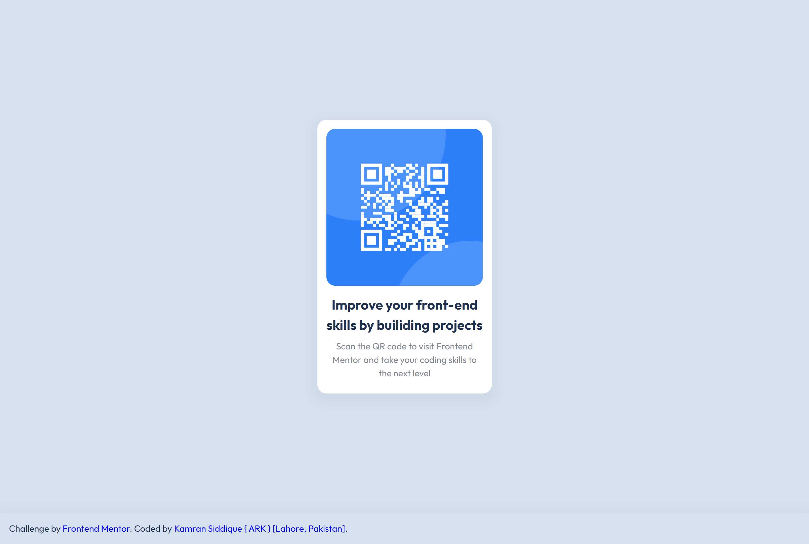

# Frontend Mentor - QR code component solution

This is a solution to the [QR code component challenge on Frontend Mentor](https://www.frontendmentor.io/challenges/qr-code-component-iux_sIO_H). Frontend Mentor challenges help you improve your coding skills by building realistic projects.

## Table of contents

- [Overview](#overview)
  - [Screenshot](#screenshot)
  - [Links](#links)
- [My process](#my-process)
  - [Built with](#built-with)
- [Author](#author)

## Overview

### Screenshot

### Links

- Solution URL: [Source Code](https://github.com/ARK-09/QR-code-component)
- Live Site URL: [Demo](https://qr-code-component-ivory-mu.vercel.app/)

## My process

### Built with

- HTML5 markup
- CSS

## Author

- Website - [Kamran Siddique [ARK]](https://github.com/ARK-09/)
- Twitter - [\_KamranSiddique](https://twitter.com/_KamranSiddique)
